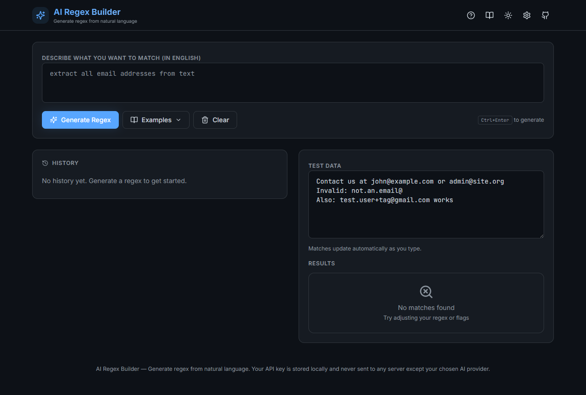

# AI Regex Builder




Generate regular expressions from natural language descriptions. Test, explain, and export regex patterns instantly.

## Why?

Regular expressions are powerful but notoriously hard to write and even harder to read. Developers waste time searching Stack Overflow, trial-and-erroring patterns, and deciphering cryptic syntax. **AI Regex Builder** solves this by letting you describe what you want in plain English — the AI generates a valid regex, explains it token-by-token, and lets you test it against real text immediately.

### The Problem

- **Regex is hard** — Syntax is cryptic, errors are opaque, debugging is painful
- **No feedback loop** — You write a pattern, test it manually, tweak, repeat
- **No explanation** — Existing tools generate regex but don't explain *why* it works
- **No export** — You get a pattern but still have to hand-format it for your language

### The Solution

| Step | What happens |
|------|-------------|
| 1. **Describe** | Type "extract all email addresses" in the prompt |
| 2. **Generate** | AI (OpenAI, Gemini, or Ollama) returns a validated regex pattern with flags |
| 3. **Test** | Paste your text — matches highlight instantly with 300ms debounce |
| 4. **Understand** | Token-by-token explanation shows what each part does |
| 5. **Export** | Copy as JS/Python/Java/Go/Rust/PHP/grep code snippet |
| 6. **Optimize** | Ask AI to optimize the regex for performance and readability |

### Who Is This For?

- **Developers** who need regex but don't want to memorize syntax
- **Data scientists** extracting patterns from text datasets
- **QA engineers** validating input formats
- **Students** learning how regex works (via the explanation feature)
- **Anyone** who's ever copy-pasted a regex without understanding it

## Features

- **AI-Powered Generation** — Describe what you want to match in English, get a regex pattern
- **Real-time Testing** — Paste your text and see matches highlighted instantly
- **Regex Explanation** — Token-by-token breakdown with color-coded token types (literals, quantifiers, groups, anchors, etc.)
- **Flags Support** — Toggle `g`, `i`, `m`, `s`, `u`, `y` flags with live updates
- **Export to 7 Languages** — JavaScript, Python, Java, Go, Rust, PHP, grep
- **Copy Options** — Pattern only, with flags, as string, as RegExp object, or all matches
- **AI Optimization** — Ask AI to optimize your regex for performance and readability
- **History** — Last 20 queries saved locally (localStorage)
- **16 Preset Examples** — Email, phone, IPv4, URLs, dates, credit cards, hex colors, and more
- **Cheat Sheet** — Quick reference for regex syntax (click to insert)
- **Dark/Light Theme** — Toggle between themes, persisted in localStorage
- **Keyboard Shortcuts** — Full shortcut support with help modal
- **OpenAI, Gemini & Ollama Support** — Use OpenAI, Google Gemini API, or run locally with Ollama
- **Error Boundaries** — Graceful crash recovery
- **Robust Error Handling** — Network timeouts, invalid JSON, quota errors, and clipboard failures all handled gracefully with user-friendly messages
- **Typed Toast Notifications** — Success (green), error (red), and warning (yellow) toasts with appropriate icons
- **Safe Clipboard** — Clipboard API with execCommand fallback for non-HTTPS contexts
- **Safe localStorage** — Guards against JSON parse errors, quota exceeded, and privacy mode
- **Regex Execution Guards** — Test text capped at 100K chars, match count capped at 10K to prevent catastrophic backtracking hangs
- **AI Request Timeouts** — All AI provider requests abort after 30s with retry logic (2 attempts)
- **Security Headers** — CSP, X-Frame-Options, X-Content-Type-Options, Referrer-Policy, Permissions-Policy on Netlify and Docker
- **XSS Prevention** — No dangerouslySetInnerHTML, no eval, no innerHTML; React auto-escapes all user input
- **API Key Safety** — Keys stored in localStorage only, sent only to provider's API, never logged
- **Code Splitting** — React, icons, and app code in separate chunks for faster caching
- **Static Asset Caching** — 1-year immutable cache for hashed assets on Netlify and Docker
- **Gzip Compression** — nginx gzip for CSS/JS/JSON/SVG in Docker deployments
- **Offline Detection** — Warning banner when offline, regex testing still works without internet
- **Responsive Design** — Works on mobile and desktop

## Quick Start

```bash
# Install dependencies
npm install

# Start dev server
npm run dev

# Build for production
npm run build

# Run tests
npm test

# Lint
npm run lint
```

Or use the convenience scripts:

- **Windows**: `start.bat` (or `install.bat` for first-time setup)
- **Linux/macOS**: `./start.sh` (or `./install.sh` for first-time setup)

## Configuration

### OpenAI (default)

1. Open the app and click the Settings icon (gear)
2. Enter your OpenAI API key (get one at [platform.openai.com/api-keys](https://platform.openai.com/api-keys))
3. Select your model (gpt-4o-mini recommended — ~$0.0001 per request)
4. Your key is stored locally in the browser and never sent to any server except OpenAI

Alternatively, set it via environment variable:

```bash
cp .env.example .env
# Edit .env and add VITE_OPENAI_API_KEY=sk-...
```

### Google Gemini

1. Open the app and click the Settings icon (gear)
2. Switch provider to "Gemini"
3. Enter your Google AI API key (get one at [aistudio.google.com/app/apikey](https://aistudio.google.com/app/apikey))
4. Select your model (gemini-1.5-flash recommended — free tier available)
5. Your key is stored locally in the browser and never sent to any server except Google

Alternatively, set it via environment variable:

```bash
cp .env.example .env
# Edit .env and add VITE_GEMINI_API_KEY=AIza...
```

### Ollama (local, free)

1. Install [Ollama](https://ollama.ai)
2. Run `ollama pull llama3`
3. Open Settings in the app and switch to "Ollama"
4. Make sure Ollama is running at `http://localhost:11434`

## Usage

### Basic Workflow

1. **Type a description** — e.g., "extract all email addresses from text"
2. **Press Generate** (or `Ctrl+Enter`) — AI returns a regex like `[a-zA-Z0-9._%+-]+@[a-zA-Z0-9.-]+\.[a-zA-Z]{2,}`
3. **Paste test data** — Matches highlight in yellow instantly
4. **Read the explanation** — Each token is broken down (e.g., `[a-zA-Z0-9._%+-]+` → "one or more email-safe characters")
5. **Export** — Click Export, choose your language, copy the code snippet

### Examples

| Prompt | What you get |
|--------|-------------|
| "extract all email addresses" | `[a-zA-Z0-9._%+-]+@[a-zA-Z0-9.-]+\.[a-zA-Z]{2,}` |
| "match US phone numbers" | `\(\d{3}\)\s?\d{3}-\d{4}` |
| "validate IPv4 addresses" | `\b(?:\d{1,3}\.){3}\d{1,3}\b` |
| "match dates YYYY-MM-DD" | `\d{4}-\d{2}-\d{2}` |
| "match hex color codes" | `#[0-9a-fA-F]{6}` |

### Keyboard Shortcuts

| Shortcut              | Action              |
|-----------------------|---------------------|
| `Ctrl/Cmd + Enter`    | Generate regex      |
| `Ctrl/Cmd + K`        | Focus prompt input  |
| `Ctrl/Cmd + Shift + C`| Copy regex          |
| `Ctrl/Cmd + Shift + E`| Export modal        |
| `?`                   | Help (shortcuts)    |
| `Escape`              | Close any modal     |

## Tech Stack

| Component    | Technology          |
|--------------|---------------------|
| Frontend     | React 18 + Vite 5   |
| Styling      | TailwindCSS 3       |
| AI           | OpenAI / Gemini / Ollama |
| Icons        | lucide-react        |
| Tests        | Vitest (67 tests)   |
| Linting      | ESLint 8            |
| Storage      | localStorage        |

## Project Structure

```
ai-regex-builder/
├── index.html
├── package.json
├── vite.config.js
├── tailwind.config.js
├── postcss.config.js
├── .eslintrc.json
├── netlify.toml
├── Dockerfile
├── docker-compose.yml
├── start.bat / start.sh
├── install.bat / install.sh
├── .github/workflows/ci.yml
├── src/
│   ├── main.jsx
│   ├── App.jsx
│   ├── components/
│   │   ├── PromptInput.jsx
│   │   ├── RegexDisplay.jsx
│   │   ├── TestArea.jsx
│   │   ├── MatchResults.jsx
│   │   ├── Explanation.jsx
│   │   ├── Flags.jsx
│   │   ├── Examples.jsx
│   │   ├── History.jsx
│   │   ├── ExportModal.jsx
│   │   ├── CheatSheet.jsx
│   │   ├── SettingsModal.jsx
│   │   ├── OptimizeResult.jsx
│   │   ├── HelpModal.jsx
│   │   ├── ErrorBoundary.jsx
│   │   └── Toast.jsx
│   ├── hooks/
│   │   ├── useRegex.js
│   │   ├── useHistory.js
│   │   ├── useApiKey.js
│   │   ├── useTheme.js
│   │   └── useKeyboardShortcuts.js
│   ├── utils/
│   │   ├── ai.js
│   │   ├── aiFactory.js
│   │   ├── constants.js
│   │   ├── copyCommands.js
│   │   ├── safeStorage.js
│   │   ├── safeClipboard.js
│   │   ├── regexTester.js
│   │   ├── regexParser.js
│   │   └── exporters.js
│   ├── test/
│   │   ├── setup.js
│   │   ├── regexTester.test.js
│   │   ├── regexParser.test.js
│   │   ├── exporters.test.js
│   │   └── useHistory.test.js
│   └── index.css
├── docs/
│   ├── ARCHITECTURE.md
│   ├── BUSINESS_MODEL.md
│   ├── CHANGELOG.md
│   └── screenshots/
│       └── README.md
├── CONTRIBUTING.md
├── LICENSE
└── README.md
```

## Architecture

This project applies several design patterns and DDIA (Kleppmann) patterns. See [ARCHITECTURE.md](./docs/ARCHITECTURE.md) for full details.

**Design Patterns**: Factory (AI providers), Strategy (export formats), Builder (regex parser), Command (copy operations), Cache (regex compilation), Decorator (highlight segments), Singleton (API key), Observer (state-driven re-match), MVC (hooks/components/App), Safe Storage (localStorage guards), Safe Clipboard (clipboard fallback), Timeout Guard (AI request abort).

**DDIA Patterns**: Immutable Data (history), Event Sourcing (append-only log), CQRS (read/write separation), Materialized View (match results), Cache (regex cache), Idempotency (temperature=0).

## Testing

```bash
npm test           # run all 67 tests
npm run test:watch # watch mode
```

Test coverage:
- `regexTester.test.js` — 19 tests (matching, highlighting, cache, sticky flag)
- `regexParser.test.js` — 26 tests (token parsing, builder)
- `exporters.test.js` — 14 tests (7 languages + edge cases)
- `useHistory.test.js` — 8 tests (localStorage, immutability, limits)

## Deployment

### Vercel

```bash
npm run build
# Deploy the dist/ folder to Vercel
```

### Netlify

```bash
npm run build
# Build command: npm run build
# Publish directory: dist
# Node version: 20 (set in netlify.toml)
# netlify.toml included with SPA redirect and NODE_VERSION
```

### Docker

```bash
docker build -t ai-regex-builder .
docker run -p 3000:3000 ai-regex-builder
# Open http://localhost:3000
```

Or with docker-compose:

```bash
docker-compose up
```

## Contributing

See [CONTRIBUTING.md](./CONTRIBUTING.md) for development setup, code style, and PR process.

## Changelog

See [CHANGELOG.md](./docs/CHANGELOG.md) for version history.

## License

Proprietary. Copyright (c) 2026 Ezpectus. All Rights Reserved. See [LICENSE](./LICENSE).
